# How Revolutionary Is Your Football Club?

> **TR:** Futbol kulübünün ne kadar devrimci olduğunu ölç — kupalarla değil, güç dengelerini nasıl değiştirdiğinle.
>
> **EN:** Measure how revolutionary your football club really is — not by trophies, but by how it changes the balance of power.

---

## 🇬🇧 English

A bilingual (TR/EN) Next.js quiz app powered by the **Trabzon Revolution Index (TRI)** — a model that benchmarks football clubs across four dimensions of real revolutionary impact.

### How It Works

1. Enter your club's name
2. Answer questions across 4 categories
3. Get a score (0–100) and your revolution tier

### Four Dimensions

| Dimension | What it measures |
|-----------|-----------------|
| Breaking Hegemony | Did your club end an era of Big-3 dominance? |
| Speed of Rise | How quickly did your club reach the top? |
| Sustainability | How long did your club hold its position? |
| European Impact | Did your club perform on the continental stage? |

### Score Tiers

| Score | Tier |
|-------|------|
| 100 | The Benchmark (TRI) |
| 90–99 | Trabzon-Level Revolution |
| 81–89 | Strong Revolution |
| 61–80 | Hegemony Breaker |
| 41–60 | League Disruptor |
| 21–40 | Established Power |
| 0–20 | The Status Quo |

### Screenshots

**Home**
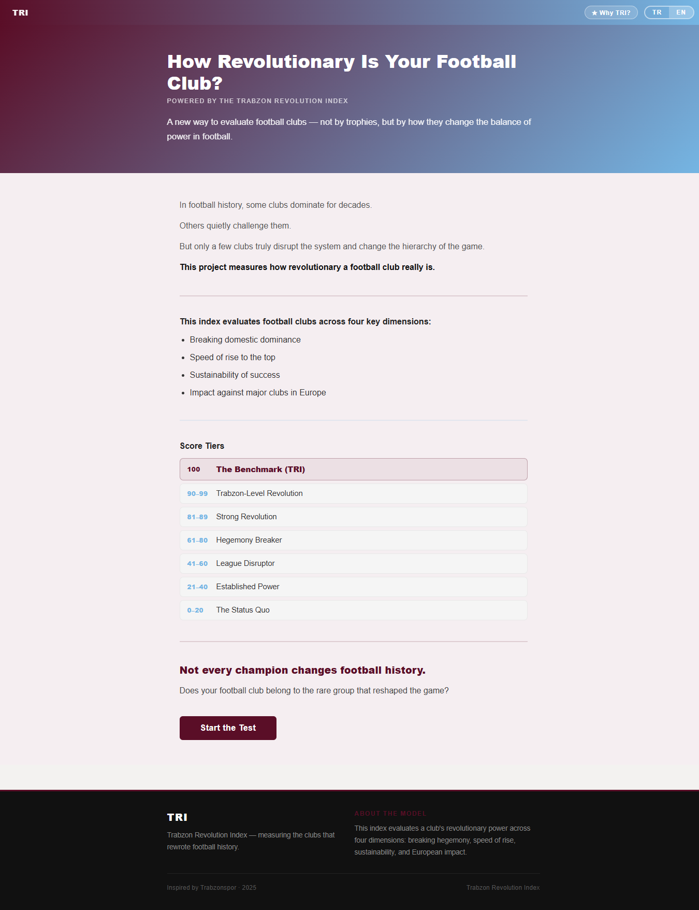

**Club Name Entry**
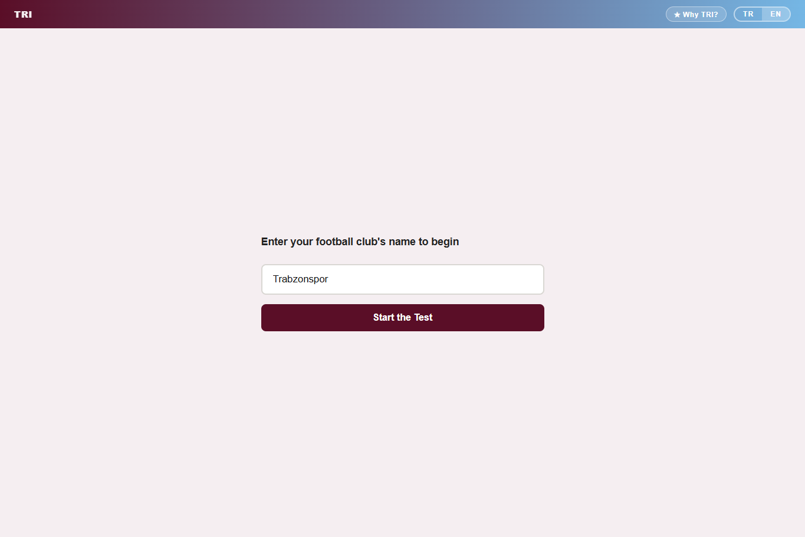

**Quiz Question**
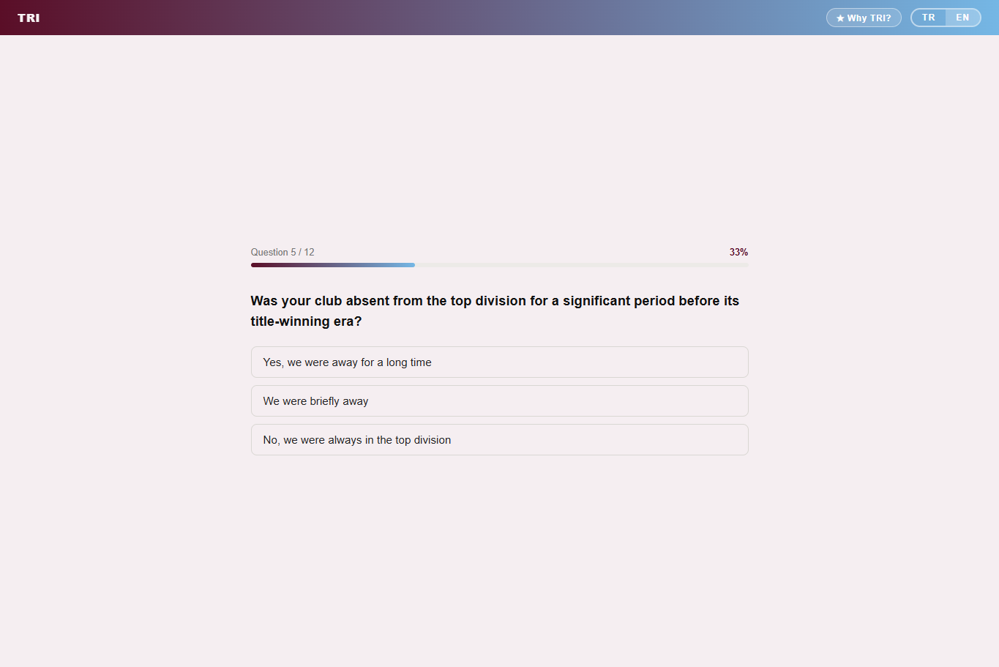

**Result Page**
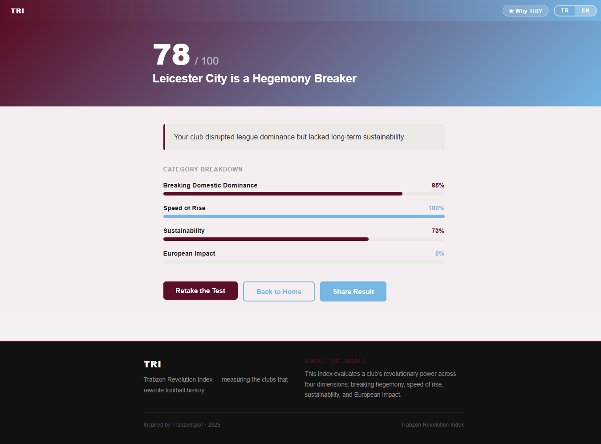

**Shareable Result Card**
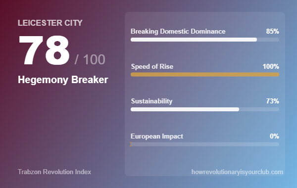

**Why TRI? Modal**
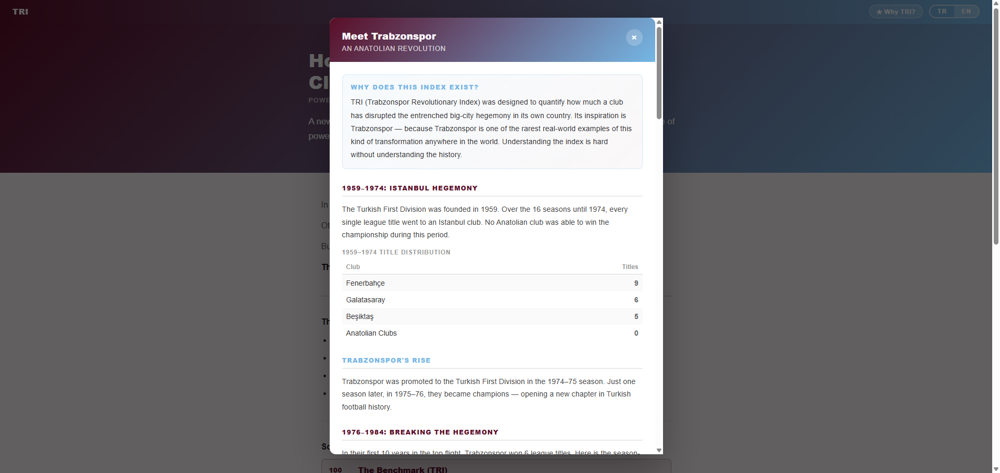

### Tech Stack

- [Next.js 15](https://nextjs.org/) + React 18
- TypeScript
- No external UI library — pure inline styles
- Canvas API for shareable result images

### Getting Started

```bash
npm install
npm run dev
```

---

## 🇹🇷 Türkçe

**Trabzon Devrim Endeksi (TRI)** ile çalışan, Türkçe/İngilizce iki dilli bir Next.js quiz uygulaması. Kulüpleri kupa sayısıyla değil, futbolun güç dengelerini ne kadar değiştirdikleriyle ölçer.

### Nasıl Çalışır

1. Kulübünün adını gir
2. 4 kategoride soruları yanıtla
3. 0–100 arası skorunu ve devrim seviyeni öğren

### Dört Boyut

| Boyut | Ne ölçer |
|-------|---------|
| Hegemonya Kırma | Kulübün Büyük-3 dönemini sona erdirdi mi? |
| Yükseliş Hızı | Zirveye ne kadar hızlı çıktı? |
| Sürdürülebilirlik | Konumunu ne kadar korudu? |
| Avrupa Etkisi | Kıtasal arenada iz bıraktı mı? |

### Skor Seviyeleri

| Skor | Seviye |
|------|--------|
| 100 | Kıstas (TRI) |
| 90–99 | Trabzon Çaplı Devrim |
| 81–89 | Güçlü Devrim |
| 61–80 | Hegemonya Kırıcı |
| 41–60 | Lig Bozucu |
| 21–40 | Köklü Güç |
| 0–20 | Statüko |

### Ekran Görüntüleri

**Ana Sayfa**
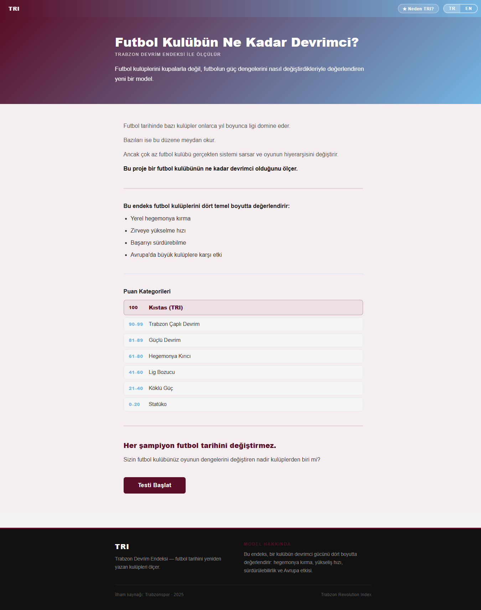

**Kulüp Adı Girişi**
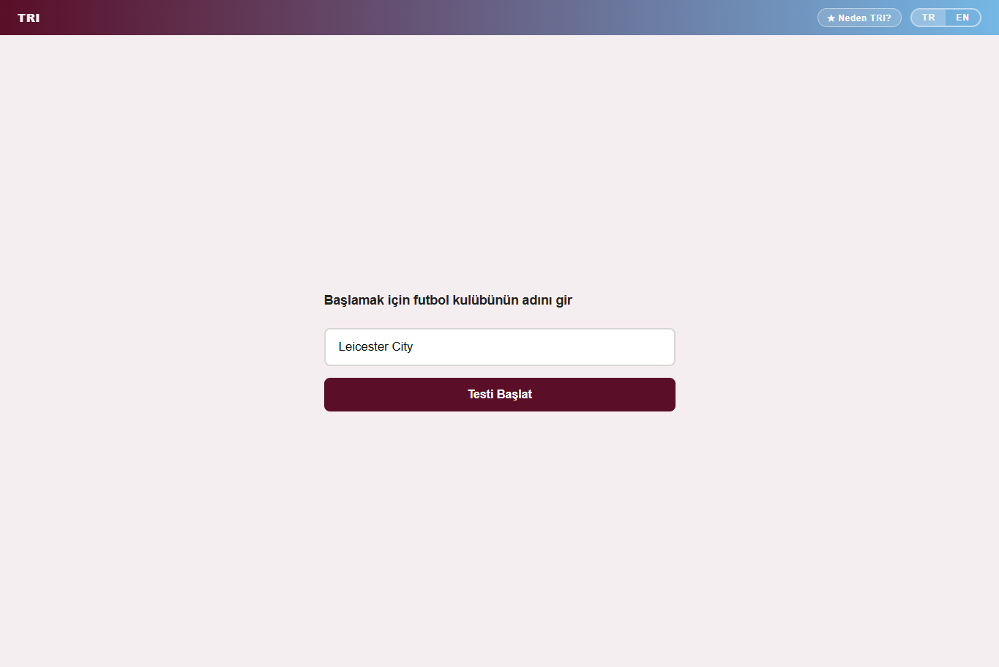

**Soru Ekranı**
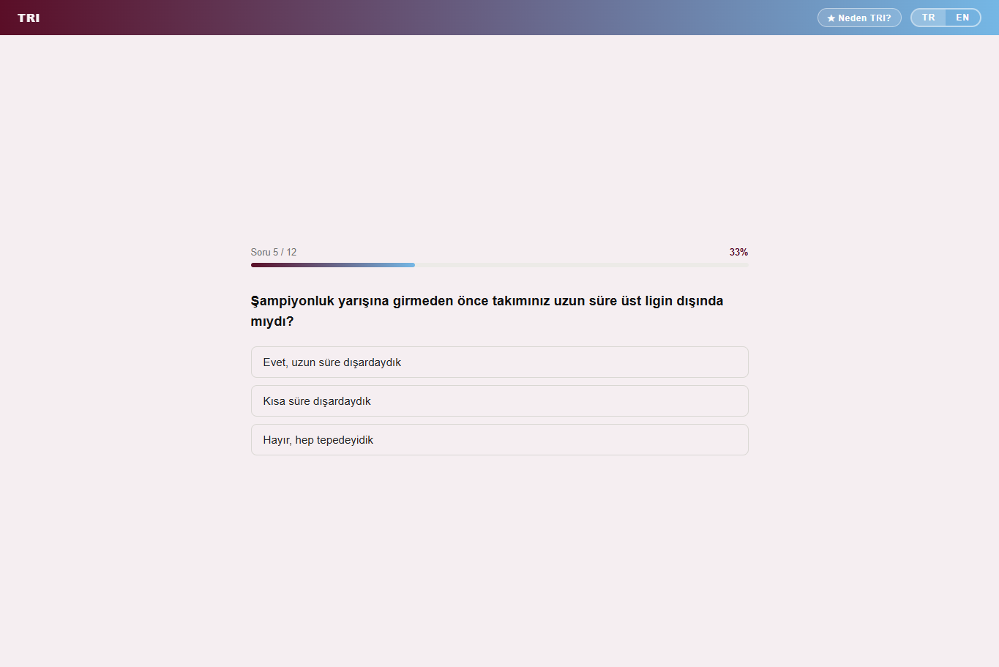

**Sonuç Sayfası**
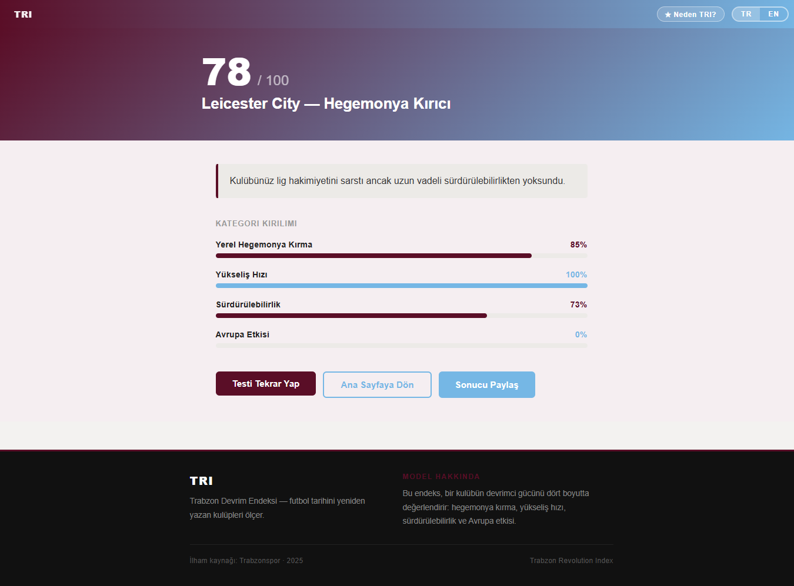

**Paylaşılabilir Sonuç Kartı**
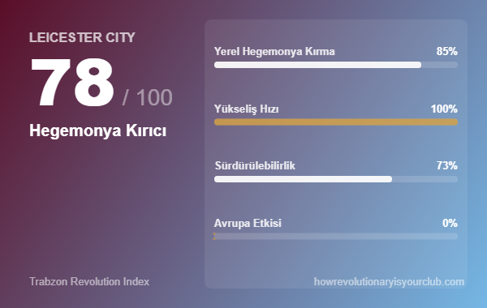

**Neden TRI? Modalı**
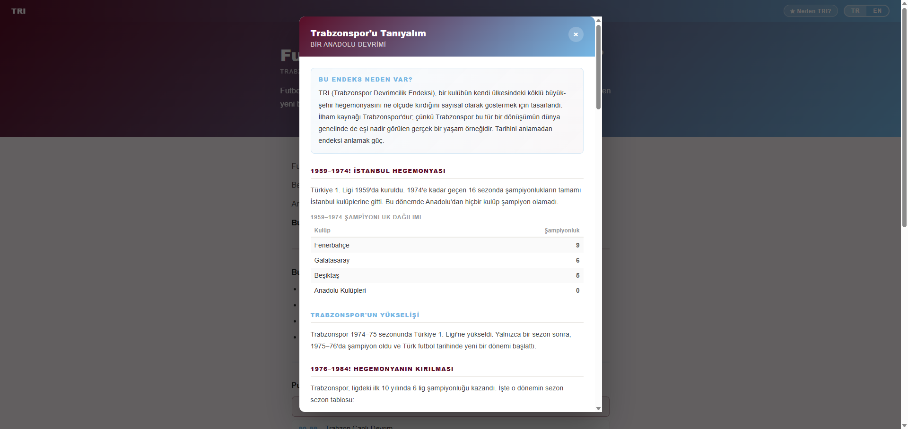

### Başlarken

```bash
npm install
npm run dev
```
